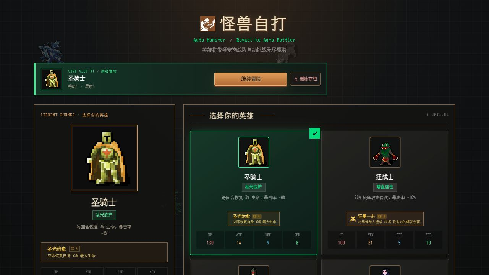
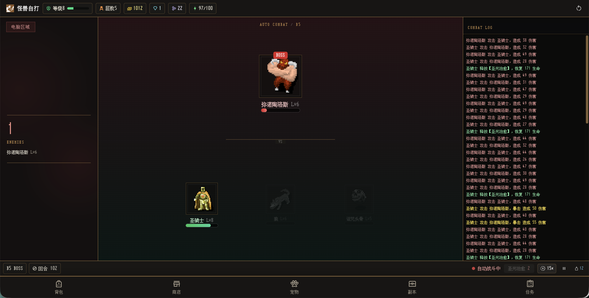
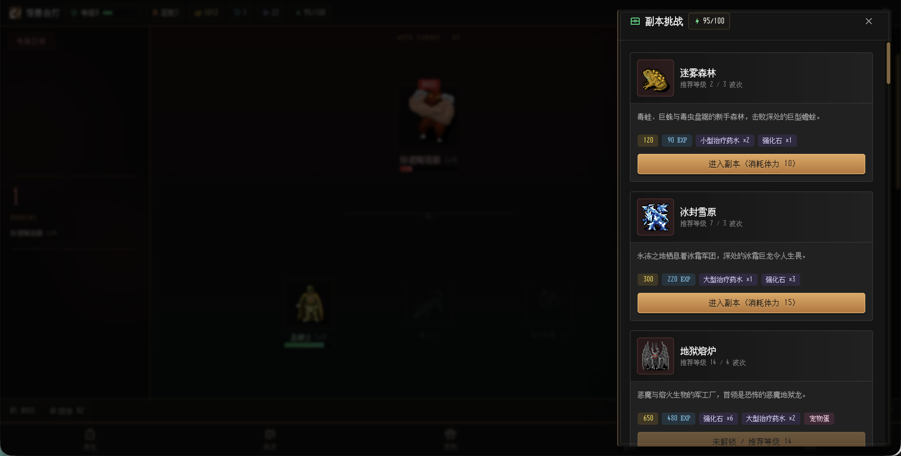
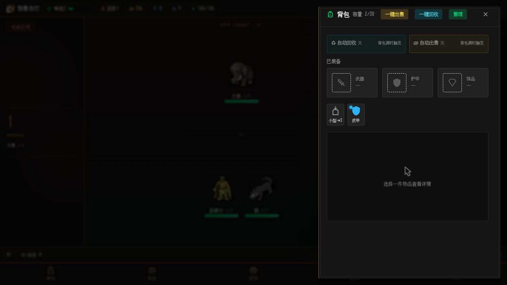
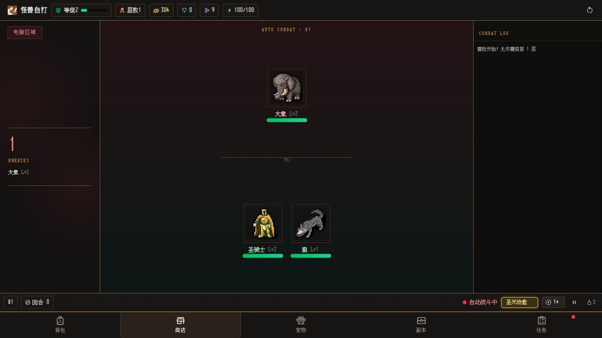
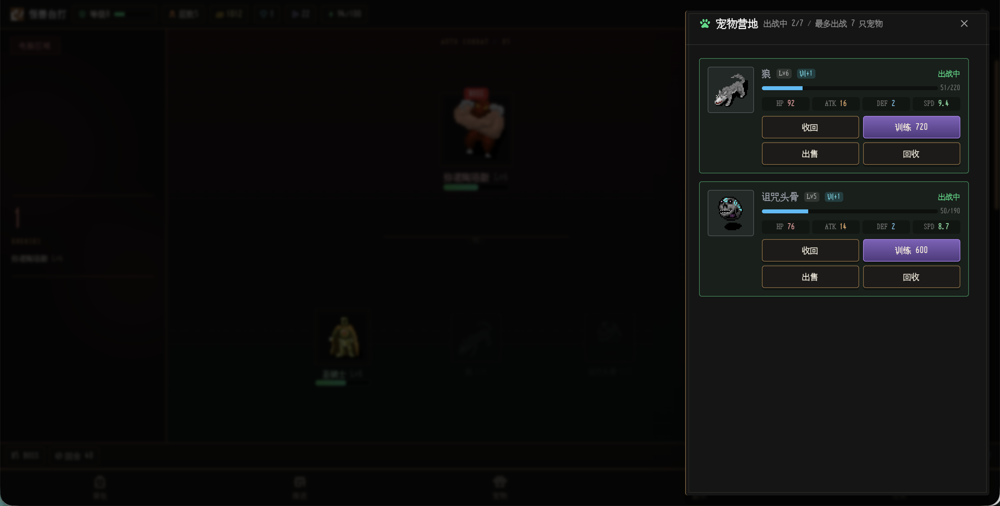
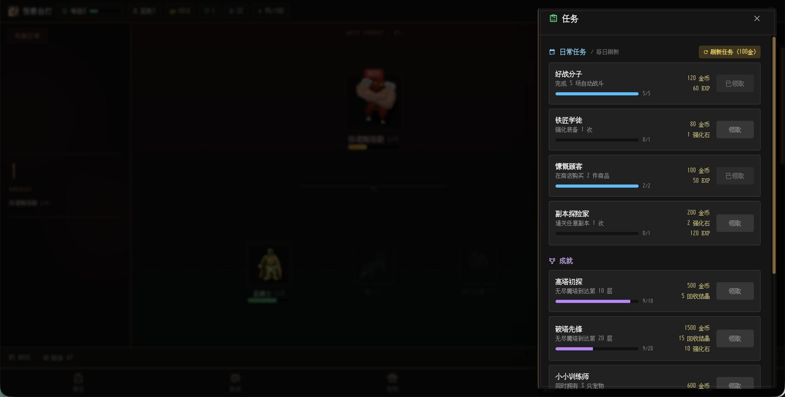
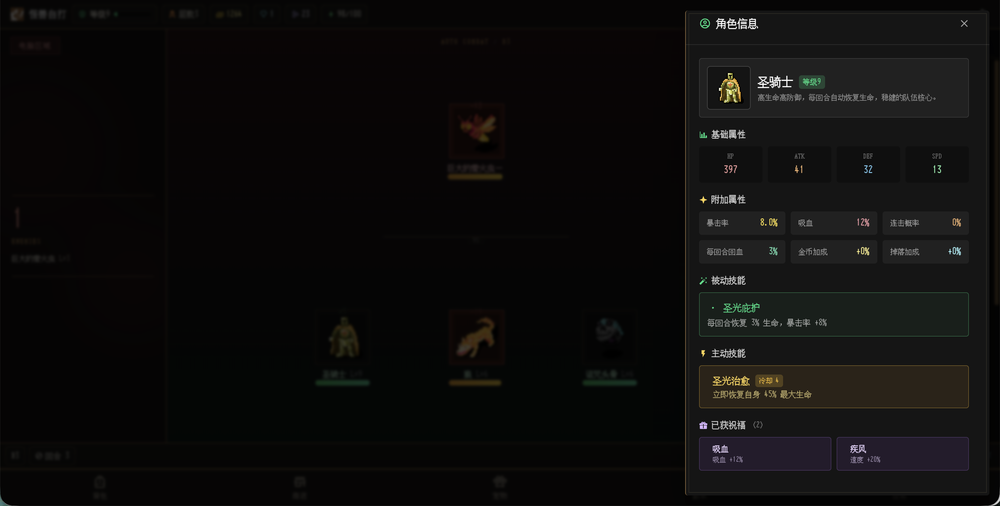

# Auto Monster · 怪兽自打

> 一款 Roguelike 自动化挂机战斗小游戏，英雄带领宠物战队自动挑战无尽魔塔。

## 游戏介绍

怪兽自打（Auto Monster）是一款自动化的 Roguelike 挂机战斗游戏。游戏使用 [Dungeon Crawl Stone Soup](http://crawl.develz.org/wordpress/) 的游戏图块，可在 [opengameart.org](https://opengameart.org/content/dungeon-crawl-32x32-tiles) 游戏素材网站进行下载。

选择你的英雄，组建宠物战队，在无尽魔塔中自动战斗、收集装备、强化养成。每 5 层击败首领后，还能从 3 个 Roguelike 祝福中选择 1 个，让每一次冒险都充满变数。



## 游戏玩法

### 英雄选择

游戏提供 4 位风格迥异的英雄，每位英雄拥有独特的属性成长、被动技能和主动技能：

| 英雄 | 定位 | 技能 | 特点 |
|------|------|------|------|
| 圣骑士 | 坦克/续航 | 圣光庇护 | 每回合恢复 3% 生命，暴击率 +8%；主动技能可恢复 45% 最大生命 |
| 狂战士 | 爆发输出 | 嗜血连击 | 20% 概率攻击两次，暴击率 +10%；主动技能造成 320% 攻击伤害 |
| 死灵法师 | 脆皮高伤 | 生命汲取 | 攻击附带 15% 吸血；主动技能对所有敌人造成范围伤害 |
| 吸血鬼 | 速度/续航 | 暗夜血族 | 10% 吸血，速度超群；主动技能造成伤害并吸血 |

### 自动战斗

进入战斗后，英雄与出战宠物将自动与敌人交战。战斗按速度排序出手，支持暴击、连击、吸血、回血等机制。你可以随时暂停战斗，或在战斗中使用药水紧急回血。



### 无尽魔塔

无尽魔塔是游戏的核心玩法，层数无限递增：

- **普通层**：遭遇逐渐增加的普通怪物，击败后获得金币、经验和战利品
- **首领层**（每 5 层）：挑战强力 Boss，击败后触发 **Roguelike 祝福三选一**
- 敌人属性随层数提升，越往后越具挑战

### Roguelike 祝福

每通过一个首领层，可从 3 个随机祝福中选择 1 个，永久强化本次冒险：

- 战吼：攻击力 +18%
- 坚壁：生命上限 +22%
- 铁壁：防御 +30%
- 疾风：速度 +20%
- 致命：暴击率 +15%
- 吸血：获得 12% 吸血
- 连击：20% 概率攻击两次
- 自愈：每回合恢复 4% 生命
- 兽王：宠物全属性 +25%
- 贪婪：金币收益 +40%
- 幸运：战利品掉落率 +15%

### 副本系统

除了无尽魔塔，还有多个主题副本可供挑战。副本会随角色等级逐步解锁，消耗体力进入，通关后获得金币、经验、材料、药水，部分副本还会奖励宠物蛋：

以下是前期副本示例：

| 副本 | 推荐等级 | 波次 | 首领 | 奖励 |
|------|----------|------|------|------|
| 迷雾森林 | 2 | 3 | 巨型蟾蜍 | 金币、经验、药水、强化石 |
| 冰封雪原 | 7 | 3 | 冰霜巨龙 | 金币、经验、药水、强化石 |
| 地狱熔炉 | 14 | 4 | 恶魔地狱龙 | 金币、经验、药水、强化石、宠物蛋 |
| 光谱裂隙 | 22 | 4 | 光谱龙 | 金币、经验、强化石、宠物蛋 |



### 装备系统

装备分为 **武器、护甲、饰品** 三个槽位，品质从低到高为：普通 → 稀有 → 史诗 → 传说。

- **强化**：消耗金币和强化石提升装备强化等级，最高 +99，有概率失败
- **升阶**：强化 +5 以上可消耗灵魂结晶提升品质
- **回收**：分解装备获得强化石和灵魂结晶
- **出售**：将不需要的装备换成金币



### 背包系统

背包容量为 30 格，支持：

- **整理**：按类型和品质自动排序
- **出售**：卖出装备、药水等获得金币
- **回收**：分解装备获取强化石与灵魂结晶
- **使用**：战斗中使用药水恢复生命
- **自动处理**：背包满时按等级、品质规则自动出售或回收装备

### 商店系统

神秘商店出售 6 个随机商品，可消耗金币刷新：

- 装备（2 个，随机品质和槽位）
- 治疗药水（2 个，小型或大型）
- 强化石
- 宠物蛋（随机品质宠物）



### 宠物系统

宠物可以协助英雄战斗，最多同时出战 7 只：

- **出战 / 收回**：管理宠物上阵状态
- **训练**：消耗金币提升宠物训练等级，最高训练 10 级，增强属性
- **出售**：将宠物卖出获得金币
- **回收**：分解宠物获得灵魂结晶

宠物品质分为普通、稀有、史诗、传说，品质越高属性越强。



### 任务与成就

- **日常任务**：每日刷新，完成自动战斗、强化装备、商店购买、通关副本等任务获取奖励
- **成就**：达成魔塔层数、收集宠物、装备史诗品质物品等里程碑，获得金币、灵魂结晶等奖励



## 游戏截图

| 英雄选择 | 自动战斗 |
|:---:|:---:|
|  |  |
| 背包装备 | 神秘商店 |
|  |  |
| 宠物营地 | 副本挑战 |
|  |  |
| 任务成就 | 角色信息 |
|  |  |

## 安装

### 在线游玩

访问 [GitHub Pages](https://smallteddy.github.io/auto-monster/) 即可在浏览器中直接游玩。

### 本地运行

```bash
# 安装依赖
pnpm install

# 启动开发服务器
pnpm dev

# 构建生产版本
pnpm build

# 预览构建结果
pnpm preview
```

## 贡献

欢迎提交 issue 和 PR。

## 许可证

该项目使用 MIT 许可证。
